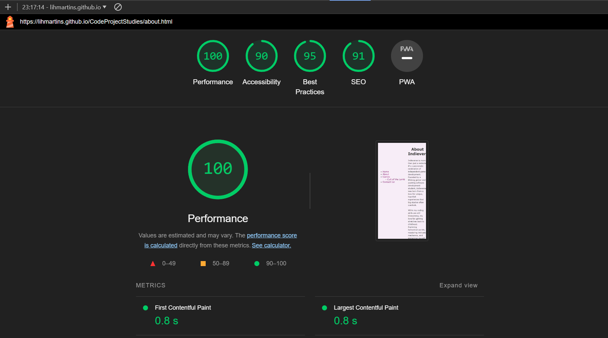

# Indieverse

Welcome to Indieverse, your go-to platform for exploring the vibrant world of indie games and their passionate developers. In the vast universe of gaming, Indieverse serves as a cosmic hub where gamers can discover, learn, and connect with unique indie titles that often fly under the radar.

## Overview

In the vast galaxy of gaming, Indieverse stands as a shining constellation dedicated to indie games and their visionary developers. Here, gamers are invited to escape the gravitational pull of conventional titles and explore the uncharted realms of indie gems. Our mission is to provide a platform where indie games take centre stage, and the developers' stories become constellations in the vastness of the gaming cosmos.

### Indieverse Layout Design: A Fusion of Simplicity and Creativity

The layout design of Indieverse reflects a deliberate effort to create a website that is both simple and stylish, with a touch of uniqueness. The overarching goal was to maintain a clean and easy-to-navigate interface while infusing a distinctive visual identity into the overall structure.

The decision to place the "Page Brand" within the left-side menu was a strategic choice aimed at providing users with a quick and seamless overview of the entire page without losing the brand essence. This approach ensures that the brand is consistently present throughout the user's journey, creating a cohesive and recognizable experience.

The content pages, in contrast, embody simplicity. The objective was to present information straightforwardly, avoiding unnecessary complexity. The navigation menus are designed to be intuitive, allowing users to easily access different sections of the website without any confusion.

The inclusion of a left bar in the layout presented a significant challenge during the creation of Indieverse. Multiple iterations, trials, and adjustments were necessary to achieve the desired outcome. Aligning various elements and maintaining a harmonious layout required meticulous attention to detail.

In the end, the layout successfully captures the essence of simplicity and creativity. Despite the challenges, the final result aligns with the initial vision, offering users a website that is both visually appealing and user-friendly. Indieverse stands as a testament to the creative journey of combining simplicity with a touch of flair, creating a unique space in the vast landscape of the internet.

## Features

- **Home: Explore the Cosmic Gateway:**
The main page welcomes users to Indieverse, providing a cosmic introduction to the universe of indie games. Users will find a brief overview of what Indieverse is all about, setting the stage for an extraordinary journey into the world of indie gaming.

- **About: Unveiling the Stargazer:**
The "About" section is a personal odyssey, offering a glimpse into the creator behind Indieverse. Discover the stargazer, the passionate gamer who embarked on a mission to bring indie games to the forefront. Get to know the force driving Indieverse and the commitment to celebrating indie creativity.

- **Games: Navigating the Celestial Library**
The heart of Indieverse, the "Games" section, is a celestial library of indie wonders. Users can explore a main page that teases upcoming reviews and sets the stage for gaming adventures. Dive deeper into the cosmos with a sub-menu featuring in-depth reviews of specific indie games. While Cult of The Lamb is the pioneer, more games are slated for exploration every week.

- **Contact: Connecting Stars**
Indieverse isn't just a portal; it's a community. The "Contact" page invites users to become part of the cosmic conversation. Whether it's sharing feedback, suggesting games for review, or developers seeking visibility, the contact page is the interstellar hub for connections.

- **Footer: Where Love Meets Bits and Bytes**
In the digital constellation of Indieverse, the footer is the cosmic bookmark that leaves an imprint of care and connection. Here, two stellar features shine brightly:

- **Cookie Harmony**
Navigating the universe of indie games requires a touch of sweetness. The Cookie Harmony in our footer warmly welcomes users, offering them a cosmic deal. Accept all cookies to enhance the journey or customise preferences in our magical cookie settings. It's not just about data; it's about creating a tailored experience for every space traveller.

- **Privacy Policy: Protecting User Information on Indieverse**

Indieverse prioritizes the privacy and security of its users. The inclusion of a dedicated Privacy Policy page underscores our commitment to transparency and safeguarding user information.

- **Crafted Affection**
Beneath the pixelated sky, the footer proudly displays the handcrafted badge of love. Every pixel, every line, and every word is a labour of affection from the Indieverse Crew. It's more than a copyright statement; it's a declaration of commitment. Crafted with love, our digital creation invites you to explore the boundless galaxies of indie gaming.

As you scroll through the cosmic tapestry of Indieverse, the footer whispers tales of care and passion—where bits and bytes embrace in a celestial dance. It's not just a sign-off; it's a cosmic hug, inviting you to experience indie gaming like never before.

- **Cosmic Connections**
Connect with the heart behind Indieverse through these cosmic portals:

- Explore the creator's gaming universe on Steam: [Steam Profile](https://steamcommunity.com/id/fucoffeelih)
- Reach out to the Indieverse Crew via email at: [Email](mailto:mynameisnotlih@gmail.com)

*Note: Indieverse has personalized these Bootstrap icons to match the unique style of our page.*

- **More Features to be Added in the Future**
Indieverse's features are carefully crafted to cater to gamers, developers, and dreamers alike. This cosmic journey is just beginning, with plans to unveil even more celestial features in the future. Welcome to Indieverse—where every feature is a star in the vast universe of indie gaming!

## Validator

- **Validator Testing**
HTML
No errors were returned when passing through the official [!WRC Validator](https://validator.w3.org/nu/)

CSS
No errors were found when passing through the official [!WRC Validator](https://validator.w3.org/nu/)

## Unfixed Bugs

Indieverse is committed to providing a seamless user experience, and we actively address and resolve bugs. However, there are a few known issues that are yet to be fixed. Here's an overview of the current challenges:

### Improvements

1. **Form Field Attributes:**
   - **Description:** Form field elements should have an `id` or `name` attribute.
   - **Status:** Unresolved
   - **Details:** Modifications have been made to adhere to improvement tips, but the message persists in DevTools. Further investigation is needed to resolve this issue.

2. **Missing Label for a Form Field:**
   - **Description:** Some form fields lack an associated label.
   - **Status:** Unresolved
   - **Details:** Despite efforts to associate labels with form fields, the message persists in DevTools. Further investigation is needed for a complete resolution.

*Note: Indieverse is actively working to address these issues and appreciates your understanding as we strive to enhance the user experience.*

## Deployment

Deploying Indieverse to GitHub was a challenging yet rewarding journey. As a first-time GitHub user, I encountered some hurdles, but the learning process was invaluable.

### Steps to Deploy

1. **Linking Visual Studio Code to GitHub:**
   - To initiate the deployment process, I first linked my Visual Studio Code directory to GitHub.
   - Created a repository on GitHub to host the Indieverse project.

2. **Adjusting Branch for Deployment:**
   - As part of the deployment setup, I had to adjust the branch settings.
   - Followed the steps provided in the Visual Studio Code documentation: [Intro to Git - Publish local repository to GitHub](https://code.visualstudio.com/docs/sourcecontrol/intro-to-git#:~:text=Publish%20local%20repository%20to%20GitHub&text=Use%20the%20Publish%20to%20GitHub,code%20to%20the%20remote%20repository.)

3. **GitHub Pages Deployment:**
   - Deploying to GitHub Pages involved navigating to the Settings tab in the GitHub repository.
   - From the source section drop-down menu, I selected the Main Branch.
   - The Main branch selection triggered an automatic refresh, and a detailed ribbon display confirmed the successful deployment.

### Live Content

The live version of Indieverse is accessible [here](https://lihmartins.github.io/CodeProjectStudies/).

## Credits

### Description

Starting from scratch and creating Indieverse was a monumental challenge for me, being my first venture into webpage development. The journey involved a significant amount of struggle, training, and trial and error. However, the learning process was incredibly rewarding, and I gained a wealth of knowledge along the way.

### Websites and Resources Used

For crafting the code and styling the webpage, I referred to several websites, not using any templates but relying on the following resources:

- [MDN Web Docs - HTML Element Reference](https://developer.mozilla.org/en-US/docs/Web/HTML/Element)
- [ThoughtCo - Adding Internal Links in HTML](https://www.thoughtco.com/adding-internal-links-3466484)
- [CSS Tricks - Flexbox Guide](https://css-tricks.com/wp-content/uploads/2022/02/css-flexbox-poster.png)
- [HubSpot Blog - HTML Dropdowns](https://blog.hubspot.com/website/html-dropdown)
- [FreeCodeCamp Forum - Dropdown Movement](https://forum.freecodecamp.org/t/how-to-keep-a-dropdown-from-moving-elements/424626)
- [W3C - HTML Specification](https://html.spec.whatwg.org/multipage/dom.html#sectioning-content-2)
- [W3C - Web Content Accessibility Guidelines](https://www.w3.org/TR/WCAG22/)
- [W3Schools - HTML Tutorials](https://www.w3schools.com/html/default.asp)
- [Webflow University - Interactive Learning](https://university.webflow.com/interactive-learning)
- [Webflow Designer - Flexbox Game](https://preview.webflow.com/preview/flexbox-game?utm_medium=preview_link&utm_source=designer&utm_content=flexbox-game&preview=d1a26b027c4803817087a91c651e321f&workflow)
- [LibreOffice Forum - Sideways Headers and Footers](https://ask.libreoffice.org/t/how-do-i-make-sideways-headers-and-footers/49318/5)
- [Bootstrap Studio - How to Remove Underline From Link](https://forum.bootstrapstudio.io/t/how-to-remove-underline-from-link/9739)
- [Stack Overflow - Weird Underline on Bootstraps Icon](https://stackoverflow.com/questions/33835756/after-including-bootstrap-icons-get-weird-underline)

### GitHub Struggles

Navigating the intricacies of GitHub was challenging, and these resources provided valuable insights:

- [FreeCodeCamp - Introduction to Git and GitHub](https://www.freecodecamp.org/news/introduction-to-git-and-github/)
- [Visual Studio Code Docs - Intro to Git and GitHub](https://code.visualstudio.com/docs/sourcecontrol/intro-to-git#:~:text=Publish%20local%20repository%20to%20GitHub&text=Use%20the%20Publish%20to%20GitHub,code%20to%20the%20remote%20repository.)
- [GitHub Docs - Using GitHub Codespaces in Visual Studio Code](https://docs.github.com/en/codespaces/developing-in-a-codespace/using-github-codespaces-in-visual-studio-code)

### Code Creation and Testing

Utilised material notes from the Software Development course and tested code snippets on [W3Schools TryIt Editor](https://www.w3schools.com/html/tryit.asp?filename=tryhtml_default).

### Font Selection

Researched font accessibility tips on:

- [HubSpot Blog - Fonts Accessibility](https://blog.hubspot.com/website/accessibility-fonts)
- [Accessibility Checking - Fonts Accessibility](https://www.accessibilitychecking.com/blog/fonts-accessibility/#:~:text=One%20of%20the%20most%20accessible,are%20all%20sans%2Dserif%20fonts.&text=The%20slab%20serif%20fonts%20that,rather%20than%20the%20body%20text.)

### Icons for Footer

Utilized Bootstrap Icons from [Bootstrap Icons](https://cdn.jsdelivr.net/npm/bootstrap-icons@1.11.3/font/bootstrap-icons.min.css).

### Video Content

Integrated YouTube videos for gameplay:

- [Cult of Lamb Gameplay with Devs](https://www.youtube.com/embed/KxEe6n9nqrk)
- [dotAge Gameplay](https://www.youtube.com/embed/m4crJPLWC30)

### GIFs

Included GIFs from:

- [Tenor GIF](https://tenor.com/brzZ7.gif)
- [Tenor GIF](https://media1.tenor.com/m/pQGITlIh3jQAAAAC/computer-games.gif)

### Logo Creation

Designed the Indieverse logo using [Designs.ai Logo Maker](https://designs.ai/en/logomaker).

### Image Hosting

Uploaded the logo on [Imgur](https://lihdev.imgur.com/).

### README Resources

I had to research extensively on how to create and write a compelling README.md file, and these resources played a crucial role in shaping the narrative:

- [Make a README](https://www.makeareadme.com/)
- [FreeCodeCamp - How to Write a Good README File](https://www.freecodecamp.org/news/how-to-write-a-good-readme-file/)
- [GitHub Docs - About READMEs](https://docs.github.com/en/repositories/managing-your-repositorys-settings-and-features/customizing-your-repository/about-readmes)
- [Code Institute Solutions README Template](https://github.com/Code-Institute-Solutions/readme-template)

The culmination of all these resources and tools resulted in the creation of Indieverse, a project I am immensely proud of.

## Lighthouse Desktop Performance

## Lighthouse Mobile Performance

## Security Overview

## Finals

Indieverse is not just a website; it's a cosmic journey into the indie gaming universe. The project blends creativity, community, and a love for indie games to offer users a unique and engaging experience. From detailed game reviews to personal connections in the About and Contact sections, Indieverse is a testament to the dedication and passion for indie gaming.

Crafted with ❤️ by the Indieverse Crew © 2024. All rights reserved.
